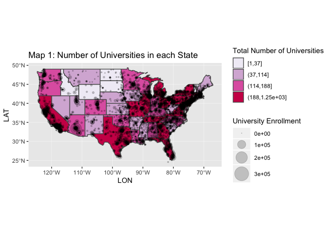
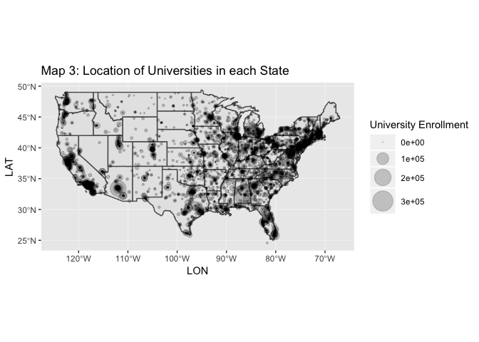

Practicing Mapping
================
Abby Bergman
11/14/2018

For this assignment, I was interested in exploring the density of universities in different states. At first, I created several maps to see which one would provide the ideal way to visualize my data. The [Map 1](https://github.com/abbygirlrose/hw07/blob/master/hw7_files/figure-markdown_github/unnamed-chunk-5-1.png) shows the contiguous United States, colored and overlayed with points. The colors show the total number of universities in a given state, split into four groups. The points show the locations of universities, with size of the point denoting total enrollment of the university. According to this map, states including California, Texas and several eastern states.

This map draws an interesting contrast with the [Map 2](https://github.com/abbygirlrose/hw07/blob/master/hw7_files/figure-markdown_github/unnamed-chunk-5-2.png), which shows the number of universities in each state divided by state population, because the states that have the highest ratio of universities to population occurs in states such as Montana and Maine. I also chose to display [Map 3](https://github.com/abbygirlrose/hw07/blob/master/hw7_files/figure-markdown_github/unnamed-chunk-5-3.png) which only shows the university location (points) and total enrollment (point size).

I chose to work with a map of the contiguous United States because I was interested in looking at the data across a large scale map. The range of point sizes was chosen so that differences in enrollment size would be clearly defined. I chose to display the number of universities per state as cut intervals because when they were initially displayed as continuous, it was difficult to distinguish between the values. Showing them in cut intervals made it easier to visualize states as having high, moderate, or low numbers of universities. I picked my color palette to help demonstrate the the high, moderate, and low totals.
