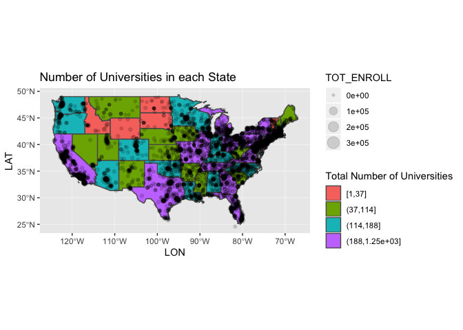

Practicing Mapping
================
Abby Bergman
11/14/2018

``` r
#load packages
library(tidyverse)
```

    ## ── Attaching packages ─────────────────────────────────────── tidyverse 1.2.1 ──

    ## ✔ ggplot2 3.1.0     ✔ purrr   0.2.5
    ## ✔ tibble  1.4.2     ✔ dplyr   0.7.7
    ## ✔ tidyr   0.8.2     ✔ stringr 1.3.1
    ## ✔ readr   1.1.1     ✔ forcats 0.3.0

    ## ── Conflicts ────────────────────────────────────────── tidyverse_conflicts() ──
    ## ✖ dplyr::filter() masks stats::filter()
    ## ✖ dplyr::lag()    masks stats::lag()

``` r
library(ggmap)
library(RColorBrewer)
library(gridExtra)
```

    ## 
    ## Attaching package: 'gridExtra'

    ## The following object is masked from 'package:dplyr':
    ## 
    ##     combine

``` r
library(fiftystater)
library(rscorecard)
library(knitr)
library(dplyr)
library(dbplyr)
```

    ## 
    ## Attaching package: 'dbplyr'

    ## The following objects are masked from 'package:dplyr':
    ## 
    ##     ident, sql

``` r
library(RSQLite)
library(sf)
```

    ## Linking to GEOS 3.6.1, GDAL 2.1.3, PROJ 4.9.3

``` r
library(viridis)
```

    ## Loading required package: viridisLite

USA data
========

data("fifty\_states") as\_tibble(fifty\_states)

make simple feature
===================

st\_as\_sf(fifty\_states, coords = c("long", "lat"))%&gt;%

\# convert fifty\_states to an sf data frame (sf\_fifty &lt;- st\_as\_sf(fifty\_states, coords = c("long", "lat")) %&gt;% \# convert sets of points to polygons group\_by(id, piece) %&gt;% summarize(do\_union = FALSE) %&gt;% st\_cast("POLYGON") %&gt;% \# convert polygons to multipolygons for states with discontinuous regions group\_by(id) %&gt;% summarize())

ggplot(data = sf\_fifty) + geom\_sf()

``` r
#import school data
schools_by_state <- read_csv("/Users/AbigailBergman/Desktop/Grad School/Fall Quarter 2018/Computing/Homework/hw7/schools_by_state.csv")
```

    ## Parsed with column specification:
    ## cols(
    ##   id = col_character(),
    ##   abb = col_character(),
    ##   total = col_integer()
    ## )

``` r
population <- read_csv("/Users/AbigailBergman/Desktop/Grad School/Fall Quarter 2018/Computing/Homework/hw7/population.csv")
```

    ## Parsed with column specification:
    ## cols(
    ##   Rank = col_integer(),
    ##   id = col_character(),
    ##   `2018 Population` = col_number(),
    ##   `2018 Growth` = col_character(),
    ##   `% of US` = col_character()
    ## )

``` r
# convert fifty_states to an sf data frame
(sf_fifty <- st_as_sf(fifty_states, coords = c("long", "lat")) %>% 
   # convert sets of points to polygons
   group_by(id, piece) %>% 
   summarize(do_union = FALSE) %>%
   st_cast("POLYGON") %>%
   # convert polygons to multipolygons for states with discontinuous regions
   group_by(id) %>%
   summarize())
```

    ## Simple feature collection with 51 features and 1 field
    ## geometry type:  GEOMETRY
    ## dimension:      XY
    ## bbox:           xmin: -124.7328 ymin: 23.51704 xmax: -66.96927 ymax: 49.37173
    ## epsg (SRID):    NA
    ## proj4string:    NA
    ## # A tibble: 51 x 2
    ##    id                                                             geometry
    ##    <chr>                                                        <GEOMETRY>
    ##  1 alabama         POLYGON ((-85.07007 31.9807, -85.11515 31.90742, -85.1…
    ##  2 alaska          MULTIPOLYGON (((-123.4406 23.58187, -123.4768 23.62274…
    ##  3 arizona         POLYGON ((-114.5206 33.02771, -114.5591 33.03678, -114…
    ##  4 arkansas        POLYGON ((-94.46169 34.19677, -94.45262 34.50843, -94.…
    ##  5 california      MULTIPOLYGON (((-118.351 32.8192, -118.4201 32.80611, …
    ##  6 colorado        POLYGON ((-102.0445 37.64147, -102.042 37.38628, -102.…
    ##  7 connecticut     POLYGON ((-73.53039 41.52275, -73.51715 41.66569, -73.…
    ##  8 delaware        POLYGON ((-75.70707 38.55759, -75.71071 38.64967, -75.…
    ##  9 district of co… POLYGON ((-77.00793 38.96667, -76.9109 38.8901, -77.04…
    ## 10 florida         MULTIPOLYGON (((-80.24945 25.35494, -80.35567 25.15823…
    ## # ... with 41 more rows

``` r
#need to do left join
combined1 <-left_join(schools_by_state %>% mutate(id = tolower(id)), sf_fifty, by = "id") %>%
  filter(abb != "AK") %>%
  filter(abb != "HI")

combined <-left_join(combined1, population %>% mutate(id = tolower(id)), by = "id")

combined <- combined %>%
  mutate(per_capita = total/`2018 Population`)

#graph

ggplot(data = combined) +
  geom_sf(aes(fill = per_capita))
```

    ## Warning: Removed 8 rows containing non-finite values (stat_sf).


``` r
ggplot(data = combined1)+
  geom_sf(aes(fill = total)) + 
  labs(title = "Map of USA, Number of Colleges by State")
```

    ## Warning: Removed 8 rows containing non-finite values (stat_sf).


``` r
#bin data
combined %>%
  mutate(capita_cut = cut_number(per_capita, 4))%>%
  ggplot() +
  geom_sf(aes(fill = capita_cut)) +
  labs(title = "Number of Universities", 
       subtitle = "Divided by State Population") +
  guides(fill=guide_legend(title="Number of Universities Per Person"))
```

    ## Warning: Removed 8 rows containing non-finite values (stat_sf).


``` r
combined1 %>%
  mutate(total_cut = cut_number(total, 4))%>%
  ggplot() +
  geom_sf(aes(fill = total_cut)) +
  labs(title = "Number of Universities in each State")
```

    ## Warning: Removed 8 rows containing non-finite values (stat_sf).


``` r
display.brewer.all(type = "div")
```


``` r
#importing college data

col_shape <- st_read("/Users/AbigailBergman/Desktop/Grad School/Fall Quarter 2018/Computing/Homework/hw7/CollegesUniversities/CollegesUniversities.shp")
```

    ## Reading layer `CollegesUniversities' from data source `/Users/AbigailBergman/Desktop/Grad School/Fall Quarter 2018/Computing/Homework/hw7/CollegesUniversities/CollegesUniversities.shp' using driver `ESRI Shapefile'
    ## Simple feature collection with 7126 features and 38 fields
    ## geometry type:  POINT
    ## dimension:      XY
    ## bbox:           xmin: -170.7429 ymin: -14 xmax: 171.3784 ymax: 71.3247
    ## epsg (SRID):    4326
    ## proj4string:    +proj=longlat +datum=WGS84 +no_defs

``` r
#get rid of alaska and hawaii
college_shape <- col_shape %>%
  filter(COUNTRY == "US") %>%
  filter(LSTATE != "HI") %>%
  filter(LSTATE != "AK")

ggplot(data = college_shape) +
  geom_sf()
```


``` r
st_as_sf(fifty_states, coords = c("long", "lat")) %>% 
  # convert sets of points to polygons
  group_by(id, piece) %>% 
  summarize(do_union = FALSE) %>%
  st_cast("POLYGON")%>%
  group_by(id) %>%
  summarize()
```

    ## Simple feature collection with 51 features and 1 field
    ## geometry type:  GEOMETRY
    ## dimension:      XY
    ## bbox:           xmin: -124.7328 ymin: 23.51704 xmax: -66.96927 ymax: 49.37173
    ## epsg (SRID):    NA
    ## proj4string:    NA
    ## # A tibble: 51 x 2
    ##    id                                                             geometry
    ##    <chr>                                                        <GEOMETRY>
    ##  1 alabama         POLYGON ((-85.07007 31.9807, -85.11515 31.90742, -85.1…
    ##  2 alaska          MULTIPOLYGON (((-123.4406 23.58187, -123.4768 23.62274…
    ##  3 arizona         POLYGON ((-114.5206 33.02771, -114.5591 33.03678, -114…
    ##  4 arkansas        POLYGON ((-94.46169 34.19677, -94.45262 34.50843, -94.…
    ##  5 california      MULTIPOLYGON (((-118.351 32.8192, -118.4201 32.80611, …
    ##  6 colorado        POLYGON ((-102.0445 37.64147, -102.042 37.38628, -102.…
    ##  7 connecticut     POLYGON ((-73.53039 41.52275, -73.51715 41.66569, -73.…
    ##  8 delaware        POLYGON ((-75.70707 38.55759, -75.71071 38.64967, -75.…
    ##  9 district of co… POLYGON ((-77.00793 38.96667, -76.9109 38.8901, -77.04…
    ## 10 florida         MULTIPOLYGON (((-80.24945 25.35494, -80.35567 25.15823…
    ## # ... with 41 more rows

``` r
st_crs(sf_fifty) <- 4326

ggplot(data = combined1) +
  geom_sf() +
  geom_point(data = college_shape, aes(LON, LAT)) 
```

    ## Warning: Removed 8 rows containing non-finite values (stat_sf).


``` r
#map with total by color and points for enrollment
combined1 %>%
  mutate(total_cut = cut_number(total, 4))%>%
  ggplot() +
  geom_sf(aes(fill = total_cut)) +
  labs(title = "Number of Universities in each State") + 
  geom_point(data = college_shape, aes(x = LON, y = LAT, size = TOT_ENROLL), shape = 1, fill = "grey", alpha = .15) + 
  guides(fill=guide_legend(title="Total Number of Universities", size = guide_legend(title = "Total Enrollment"))) + scale_color_brewer()
```

    ## Warning: Removed 8 rows containing non-finite values (stat_sf).



``` r
combined %>%
  mutate(capita_cut = cut_number(per_capita, 4))%>%
  ggplot() +
  geom_sf(aes(fill = capita_cut)) +
  labs(title = "Number of Universities", 
       subtitle = "Divided by State Population") +
  guides(fill=guide_legend(title="Number of Universities Per Person"))
```

    ## Warning: Removed 8 rows containing non-finite values (stat_sf).


``` r
#blank map with colleges
ggplot(data = sf_fifty) +
  geom_sf() +
  labs(title = "Number of Universities in each State") + 
  geom_point(data = college_shape, aes(x = LON, y = LAT, size = TOT_ENROLL), alpha = .1, shape = 1) 
```

 For this assignment, I was interested in exploring the density of universities in different states. At first, I created several maps to see which one would provide the ideal way to visualize my data. The final map shows the contiguous United States, colored and overlayed with points. The colors show the total number of universities in a given state, split into four groups. The points show the locations of universities, with size of the point denoting total enrollment of the university. According to this map, states including California, Texas and several eastern states. This map draws an interesting contrast with the other map because the states that have the highest ratio of universities to population occures in states such as Montana and Maine.
